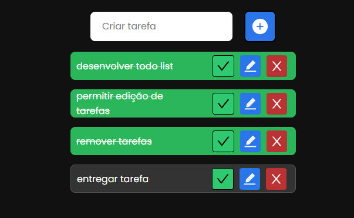

# Enzo Spagnolli - G275BE1 - DS4P41

### Todo list que permite a adicionar alterar e remover itens, com persistência dos itens em   localstorage, o que faz com que ao atualizar a pagina nenhum item da lista seja apagado

## Como rodar?

<code>git clone </code>

<code>cd todo-list</code>

<code>yarn</code>

<code>yarn dev</code>
